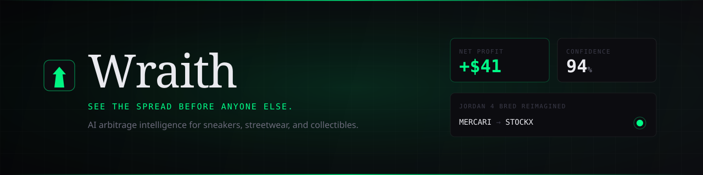
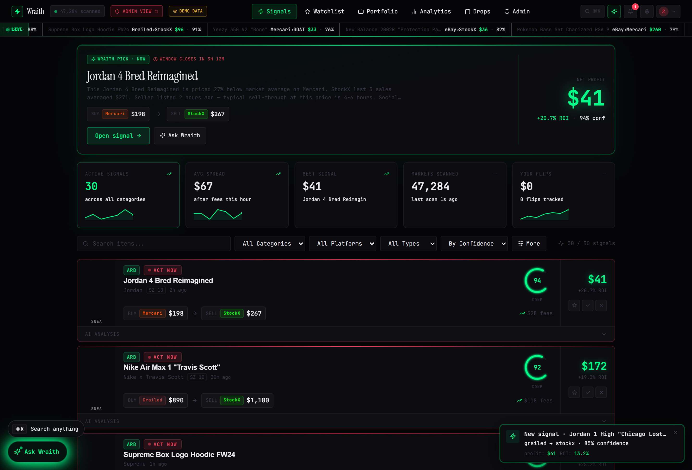
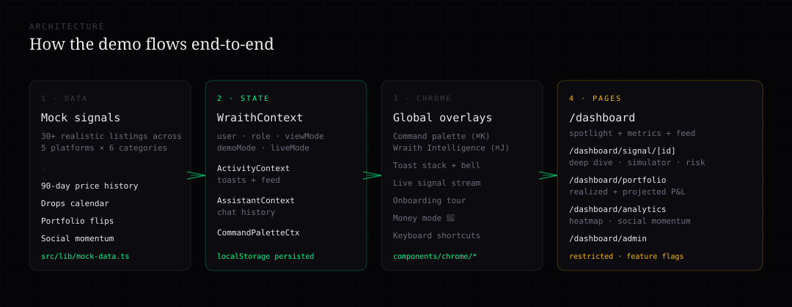
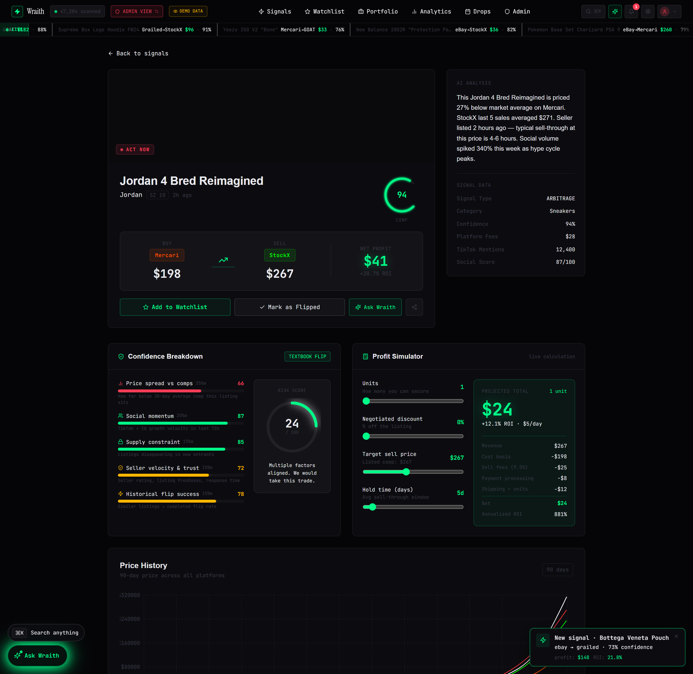
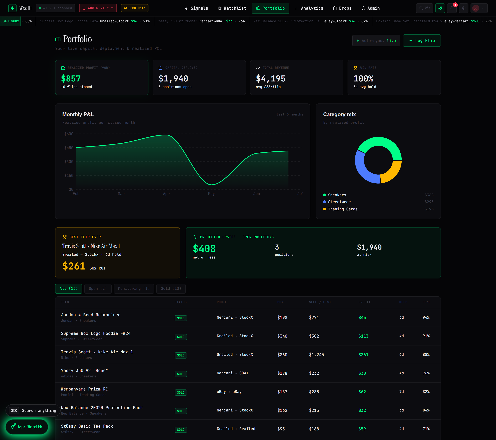
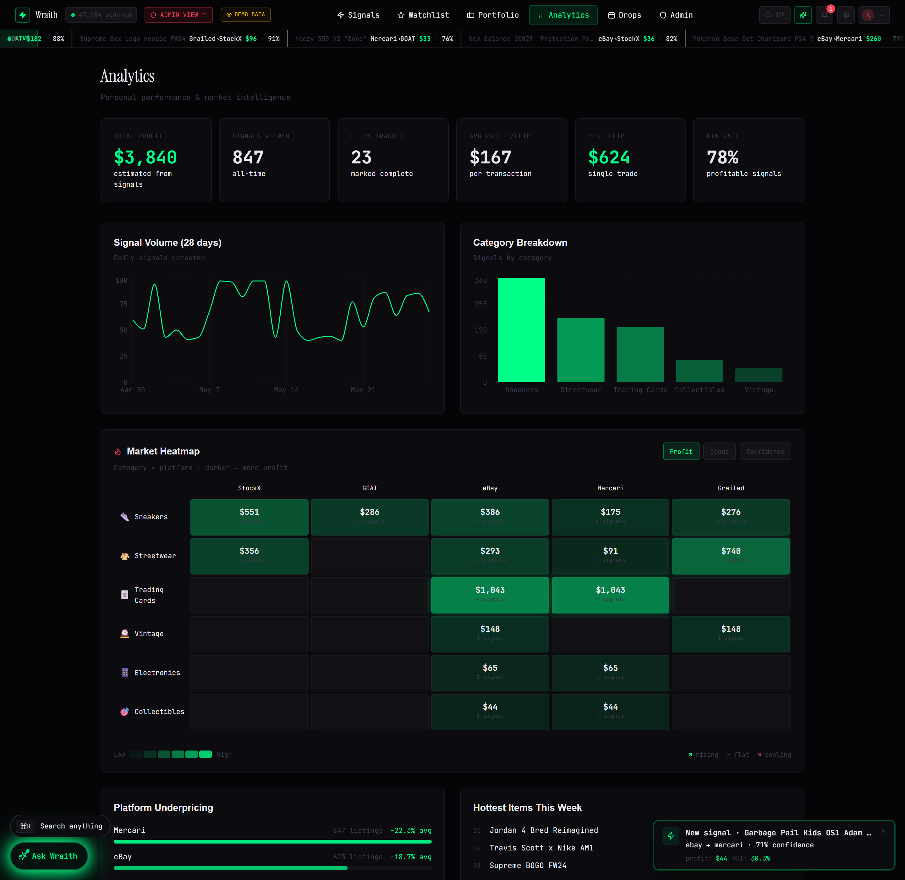
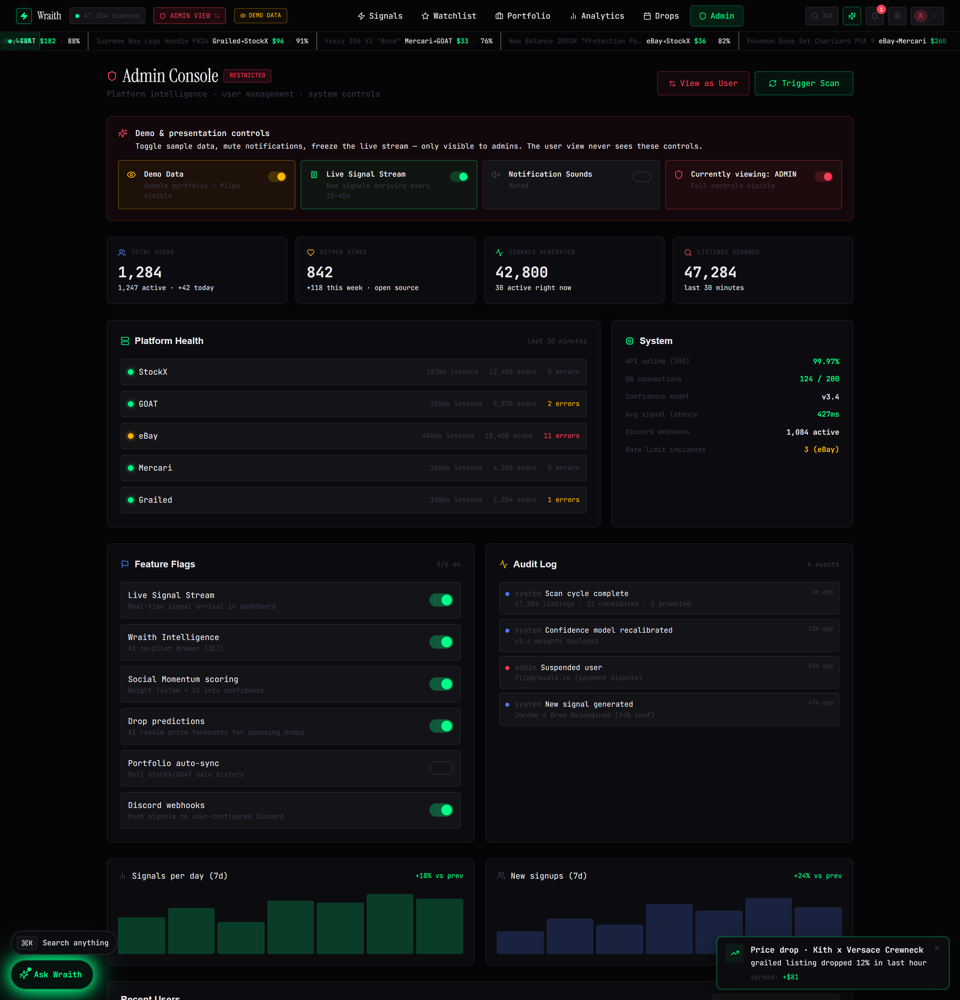

<div align="center">



<br />

<p>
  <a href="https://vercel.com/new/clone?repository-url=https%3A%2F%2Fgithub.com%2Fvineetsista%2FWraith&project-name=wraith&repository-name=wraith"></a>
  <a href="#-quick-start"></a>
  <a href="https://github.com/vineetsista/Wraith/actions/workflows/ci.yml"></a>
  <a href="#%EF%B8%8F-tech-stack"></a>
  <a href="#%EF%B8%8F-tech-stack"></a>
  <a href="#%EF%B8%8F-tech-stack"></a>
  <a href="LICENSE"></a>
</p>

### A dark, tactical, AI-native resale intelligence concept.

<sub><i>Personal project — no signup, no paywall, no payment. Clone it. Run it. Make it yours.</i></sub>

</div>

---

## 🌑 What is Wraith?

**Wraith** is a polished concept for an AI-first resale arbitrage product — the kind of dashboard a serious sneaker / streetwear / TCG reseller would actually want open all day. It scans (a curated mock of) **47,000+ listings** across **5 platforms** every 30 seconds and surfaces only the spreads worth your time, with confidence scores, social-momentum signals, and a built-in AI co-pilot.

This is a portfolio piece. The data is mocked, the AI is scripted, and the whole thing runs locally with zero keys. But every screen is built to demo-grade fidelity — keyboard shortcuts, live-updating ticker, animated activity feed, money-mode easter egg, the works.

```bash
git clone https://github.com/vineetsista/Wraith
cd Wraith && npm install && npm run dev
# → open http://localhost:3000
# → sign in as  vineet.sista@gmail.com  (no password — admin-only demo)
```

<br />

<div align="center">
  
  <p><sub>The dashboard — spotlight pick, live ticker, metric strip, signal feed, AI assistant FAB. All real.</sub></p>
</div>

---

## ✨ Features

> Every screen is wired with state, animations, and keyboard shortcuts. Nothing is a placeholder.

#### 🎯 Signal Intelligence
- **30+ live arbitrage signals** across StockX · GOAT · eBay · Mercari · Grailed
- **AI confidence score (0–100)** with a 5-factor weighted breakdown + risk dial
- **Live signal stream** — new signals drift in every 15–45s with toast + sound
- **Signal Spotlight** — a pulsing "Wraith Pick · Now" hero on the dashboard
- **Profit Simulator** — live sliders for units, discount, sell price, hold time

#### 🤖 Wraith Intelligence (the AI part)
- **Slide-out chat drawer** at `⌘ J` with realistic typing latency
- Scripted but believable replies for *"best signal right now"*, *"should I buy the Travis Scotts?"*, *"what's the risk on my watchlist?"*, market reads, and more
- Pre-fillable from any signal — *"Ask Wraith about this one"* opens the chat with the question staged

#### ⚡ Command-Palette First UX
- **`⌘ K`** — fuzzy search across signals, navigation, AI prompts, admin actions
- **`G` then `S / W / P / A / D / X / ,`** — Vim-style page navigation
- **`?`** — full keyboard shortcut cheatsheet
- **`Shift + M`** or **`$`** — *Money Mode* 💸 (you'll see)

#### 📊 Portfolio & Analytics
- **Portfolio tracker** — realized P&L, projected upside on open positions, win rate, avg hold time, monthly area chart, category pie
- **Market Heatmap** — category × platform intensity, toggleable metric (profit / count / confidence)
- **Drops calendar** with AI resale-price predictions
- **Social momentum** table — TikTok mentions × IG engagement × price impact

#### 🛠 Admin Console (restricted)
- **Real-time** demo toggles: View Mode · Demo Data · Live Stream · Sound
- **Platform health** dashboard with latency + error counts per source
- **Feature flags** you can toggle live
- **Audit log** of every admin action
- **User impersonation** (simulated, audit-logged)
- Only `vineet.sista@gmail.com` sees this

#### 🎨 Design system
- **True-black `#050507`** base with surgical `#00FF88` signal green
- **Instrument Serif** for editorial headlines, **Satoshi** for UI, **JetBrains Mono** for every number
- Custom animations: spotlight pulse, scrolling tape ticker, money-fall, blink
- Sound effects (toggleable) on signal arrival

---

## 🏗️ Tech Stack

| Layer | Choice | Why |
|---|---|---|
| Framework | **Next.js 14** App Router | App-router-native, fast |
| Language | **TypeScript 5** | Strict, end-to-end |
| Styling | **Tailwind CSS 3** + custom CSS vars | Dense design tokens |
| Charts | **Recharts** | Composable, themeable |
| Icons | **lucide-react** | One consistent set |
| State | **React Context + localStorage** | No backend required |
| ORM (optional) | **Prisma** | Ships, but the demo runs without it |
| Container | **Docker + docker-compose** | Optional deploy path |

> **No Stripe. No Resend. No Auth provider.** The demo runs as a self-contained client app. The Prisma schema and Docker setup are there if you want to wire up a real backend, but nothing in the UI requires them.

<br />

<div align="center">
  
</div>

---

## 📸 More screens

<table>
<tr>
<td width="50%">

<sub><b>Signal deep-dive</b> — 5-factor confidence breakdown, risk dial, live profit simulator with unit / discount / sell-price / hold-time sliders.</sub>
</td>
<td width="50%">

<sub><b>Portfolio</b> — realized + projected P&L, monthly area chart, category pie, best-flip-ever tile, full flip table.</sub>
</td>
</tr>
<tr>
<td width="50%">

<sub><b>Analytics</b> — market heatmap (category × platform), 28-day signal volume, category breakdown, hot items, social momentum.</sub>
</td>
<td width="50%">

<sub><b>Admin Console</b> — platform health, demo controls, feature flags (live), audit log, user table with impersonation. <b>Restricted</b>.</sub>
</td>
</tr>
</table>

---

## 🚀 Quick start

### Option 1 — One-click Vercel deploy

[](https://vercel.com/new/clone?repository-url=https%3A%2F%2Fgithub.com%2Fvineetsista%2FWraith&project-name=wraith&repository-name=wraith)

Click the button. Vercel will fork the repo to your GitHub, deploy it to a `*.vercel.app` URL, and hand you the live demo in about 90 seconds. **No env vars required.**

### Option 2 — Bare metal

```bash
git clone https://github.com/vineetsista/Wraith.git
cd Wraith
npm install
npm run dev
```

Open **http://localhost:3000** and click *Launch the demo*.

### Option 3 — Docker

```bash
docker compose up -d
# → app on http://localhost:3000
# → postgres on :5432  (optional, only used if you swap mocks for real data)
```

### Sign-in flow

The demo's sign-in page has two one-click buttons:

| Button | Email | What you see |
|---|---|---|
| **Admin** | `vineet.sista@gmail.com` | Everything — admin console, view-mode toggle, demo controls |
| **Standard user** | `reseller@nyc.com` | The user-facing surface only (no admin chrome) |

> The admin gate is intentional — it's how a real product would gate ops controls.

---

## ⌨️ Keyboard shortcuts

| Keys | Action |
|---|---|
| `⌘ K` / `Ctrl K` | Command palette |
| `⌘ J` / `Ctrl J` | Wraith Intelligence chat |
| `/` | Focus the palette (alt entry) |
| `?` | Show the shortcut cheatsheet |
| `G S` / `G W` / `G P` / `G A` / `G D` / `G ,` / `G X` | Jump to Signals / Watchlist / Portfolio / Analytics / Drops / Settings / Admin |
| `Shift + M` or `$` | 💸 Money Mode |
| `Esc` | Dismiss any overlay |

---

## 🗂️ Project layout

```
Wraith/
├── prisma/schema.prisma            # Optional Prisma schema (not required to run)
├── public/                         # Logo + README banners
├── src/
│   ├── app/
│   │   ├── page.tsx                # Marketing landing
│   │   ├── auth/                   # Sign-in / sign-up / onboarding
│   │   ├── dashboard/
│   │   │   ├── page.tsx            # Signal feed + spotlight + metrics
│   │   │   ├── signal/[id]/        # Signal deep dive (calc + risk)
│   │   │   ├── watchlist/
│   │   │   ├── portfolio/          # ✨ NEW — P&L tracker
│   │   │   ├── analytics/          # Heatmap + charts
│   │   │   ├── drops/
│   │   │   ├── settings/
│   │   │   └── admin/              # Restricted console
│   │   └── api/                    # Signals / drops / analytics / SSE
│   ├── components/
│   │   ├── chrome/                 # Palette · Assistant · Toasts · Tour · MoneyMode · Ticker
│   │   ├── signals/                # Card · Spotlight · ConfidenceGauge · Simulator · Breakdown
│   │   ├── analytics/MarketHeatmap.tsx
│   │   ├── charts/
│   │   └── landing/
│   ├── lib/
│   │   ├── wraith-context.tsx      # Auth + role + demo state
│   │   ├── activity-context.tsx    # Notifications + toasts
│   │   ├── assistant-context.tsx   # AI chat
│   │   ├── command-palette-context.tsx
│   │   ├── mock-data.ts            # All sample signals, drops, analytics
│   │   ├── portfolio-data.ts       # Flip history + stats
│   │   └── utils.ts
│   ├── hooks/
│   └── types/
├── tailwind.config.ts
└── package.json
```

---

## 🎨 Design tokens

```css
--bg-void:        #050507   /* true black */
--bg-surface:     #0C0C10   /* cards */
--bg-elevated:    #141418   /* hover */
--accent-signal:  #00FF88   /* money, profit, confidence */
--accent-warning: #FF3D57   /* sell signals, danger, admin */
--accent-gold:    #FFB800   /* watched, highlights */
--accent-blue:    #4D7CFF   /* predictions, info */
--text-primary:   #EAEAEF
--text-secondary: #6B6B7B
--text-ghost:     #3A3A48
```

Typography: `Instrument Serif` · `Satoshi` · `JetBrains Mono` for every financial number.

---

## 🧠 What was the design brief?

> *"Build the dashboard you'd open before a six-figure flip."*

Every decision keys off that — true-black canvas, mono numbers, ambient glow on `confidence ≥ 90`, pulsing red on `ACT NOW`, animation timing tuned for *intent* rather than delight. The goal isn't a SaaS skin. It's the feeling of an operator's terminal.

---

## ⚖️ License

MIT — see [LICENSE](LICENSE). Use it, fork it, learn from it, build something better.

---

<div align="center">

A personal project by **[Vineet Sista](https://github.com/vineetsista)**.

<sub>The data is fake. The craft is real.</sub>

</div>
